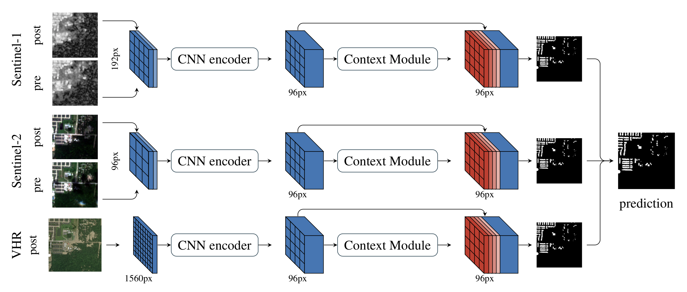

# Multi<sup>3</sup>Net

This repository contains source code and data used in

Rudner, T. G. J.; Rußwurm, M.; Fil, J.; Pelich, R.; Bischke, B.; Kopačková, V.; Biliński, P. **_Segmenting Flooded Buildings via Fusion of Multiresolution, Multisensor, and Multitemporal Satellite Imagery_**. In _AAAI_ 2019.

<p align="center">
  <a href="https://arxiv.org/abs/1812.01756">View on ArXiv</a>
</p>

**Abstract:** We propose a novel approach for rapid segmentation of flooded buildings by fusing multiresolution, multisensor, and multitemporal satellite imagery in a convolutional neural network. Our model significantly expedites the generation of satellite imagery-based flood maps, crucial for first responders and local authorities in the early stages of flood events. By incorporating multitemporal satellite imagery, our model allows for rapid and accurate post-disaster damage assessment and can be used by governments to better coordinate medium- and long-term financial assistance programs for affected areas. The network consists of multiple streams of encoder-decoder architectures that extract spatiotemporal information from medium-resolution images and spatial information from high-resolution images before fusing the resulting representations into a single medium-resolution segmentation map of flooded buildings. We compare our model to state-of-the-art methods for building footprint segmentation as well as to alternative fusion approaches for the segmentation of flooded buildings and find that our model performs best on both tasks. We also demonstrate that our model produces highly accurate segmentation maps of flooded buildings using only publicly available medium-resolution data instead of significantly more detailed but sparsely available very high-resolution data.



## Download Data

```bash
bash download_data.sh
```

## Dependencies

install depenencies in a new conda environment named `multi3net`

```
conda create -n multi3net pip
conda install pytorch torchvision -c pytorch
pip install opencv-python numpy mkl-random pandas rasterio matplotlib
```

## Run training

train
```
cd src
python train.py -x vhrs1s2 -b 1
```

## Visdom
optional

```bash
pip install visdom
```

start visdom server in another terminal (e.g., using `tmux` or `screen`) 
The visdom server provides additional visual information while training
```bash
visdom
```

## Tests

run tests
```bash
export TRAINDATA_PATH=$PWD/data/east
export VALIDATA_PATH=$PWD/data/east

cd src
python unittests.py
```

## Docker

The docker image is based on one Pytorch container of the Nvidia Container registry

Register at `ngc.nvidia.com`, create api key and log in via:
```bash
docker login nvcr.io
```

### Build

Build docker image
```bash
cd src
docker build -t multi3net .
```

### Run Unittests

```bash
nvidia-docker run \
    -v $PWD/data/east:/data/train \
    -v $PWD/data/west:/data/valid \
    multi3net \
    python unittests.py
```